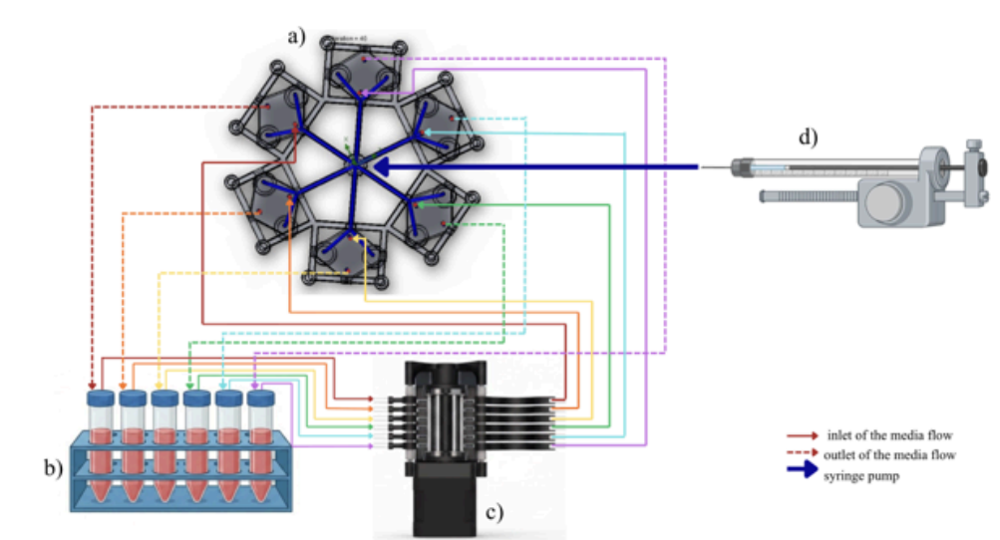
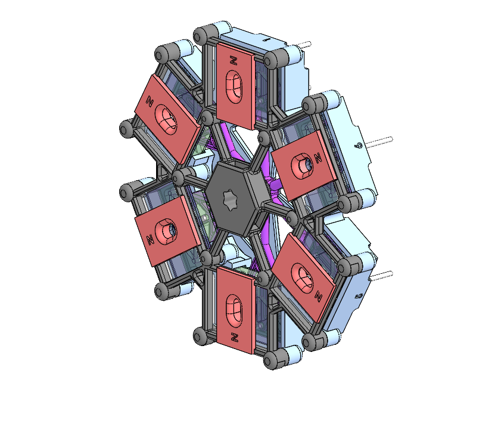
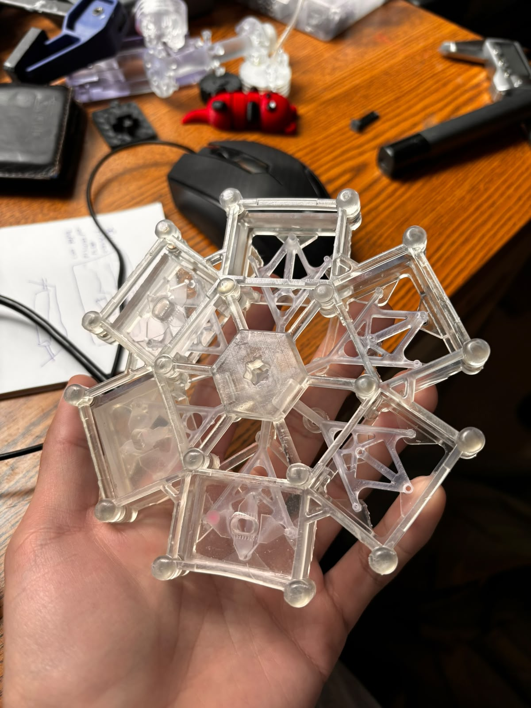
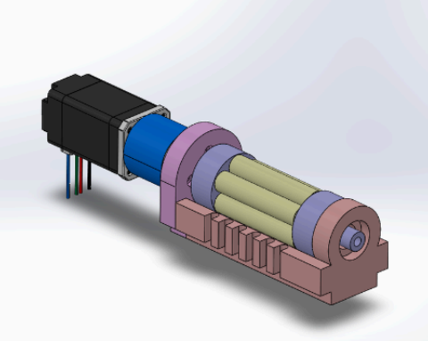
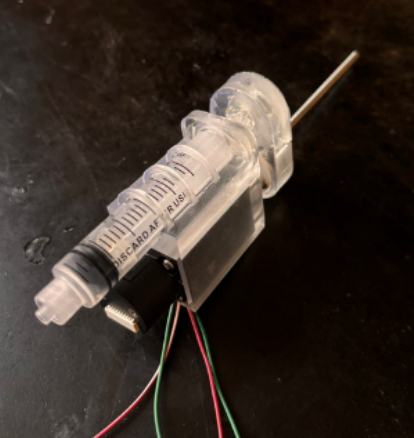
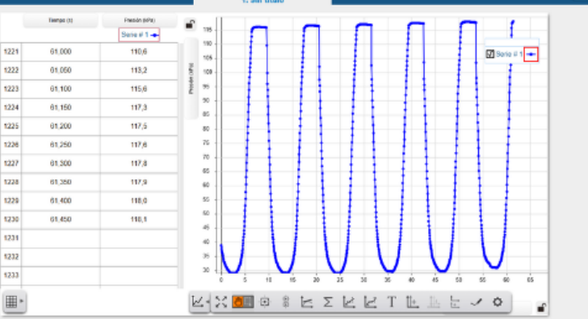
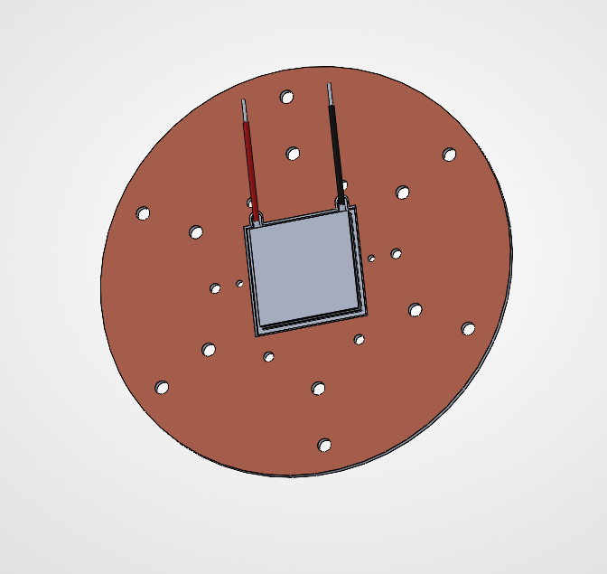
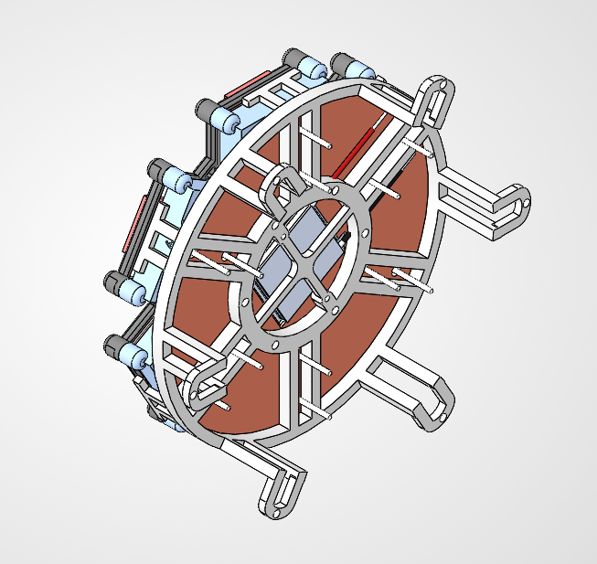
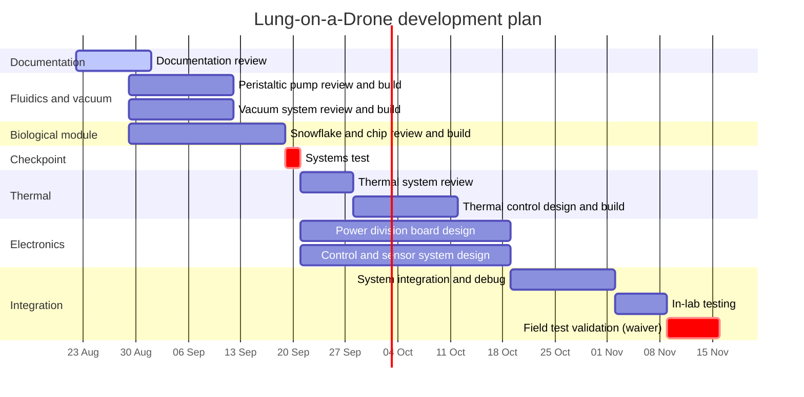

# Lung-on-a-Drone

A self-powered payload that keeps six lung-on-a-chip devices alive at body conditions while flying on a DJI Matrice 600 Pro, so lung cells can be exposed to real ambient air in flight instead of lab-simulated air.

**Status:** Rev 2.0 (June 2026). Hardware built, respiratory profile pending validation on live chips.

<p align="center">
  
</p>

---

## Contents

- [What it does](#what-it-does)
- [The Snowflake](#the-snowflake)
  - [Chip construction](#chip-construction)
  - [Fluidics](#fluidics)
  - [Vacuum and breathing](#vacuum-and-breathing)
- [Atmosphere](#atmosphere)
- [Electronics](#electronics)
- [Firmware](#firmware)
- [Operating protocol](#operating-protocol)
- [Roadmap and to-do](#roadmap-and-to-do)
- [Repository contents](#repository-contents)

---

## What it does

Lung-on-a-chip devices need three things to behave like real tissue: warm humid air, a steady flow of culture media, and a breathing motion that stretches the cells. This payload provides all three on battery power, with no operator input during flight.

| Condition | Target |
|---|---|
| Temperature | 36.5 °C ± 0.1 °C |
| Humidity | ~50 % RH |
| Media flow | 3 µL/min per chip (1 to 30 adjustable) |
| Breathing | ~10 % stretch, ~13 breaths/min |
| Flight time | 16 to 22 min under load |

Four chips are opened to sampled outside air. Two stay sealed as controls, so any effect can be attributed to the air rather than the flight itself.

The payload carries its own batteries and never draws from the drone's flight packs. This keeps flight stability and avionics isolated from payload noise.

---

## The Snowflake

The Snowflake is the biological module: a removable six-armed carrier that holds the chips and delivers all three stimuli at once. It drops into the chassis on magnets and spring-loaded contacts, so it can be swapped without tools and moved straight to an incubator after landing.

It is printed in a biocompatible resin. Standard 3D printing resins leach compounds that kill lung cells, so material choice here is not cosmetic.

<p align="center">
  
  
</p>

📁 **[Snowflake and chip CAD](https://tecmx-my.sharepoint.com/:f:/r/personal/a01643424_tec_mx/Documents/Harvard%20Medical%20School/Lung%20on%20a%20Drone/Drone%20v3/Lung%20Chips%20v3?d=w35908b0c16424d05acf1a3019ef7b8cf&csf=1&web=1&e=b5t1vh)**

### Chip construction

Earlier chips were entirely flexible silicone and collapsed vertically when vacuum was applied. The roof caved in instead of the walls stretching. Rev 2.0 fixes this by making the top and bottom rigid so the vacuum can only act sideways:

- **Floor:** glass. Rigid, doesn't absorb airborne particulates, and can go straight under a microscope.
- **Body:** flexible silicone containing the cell chamber and two side chambers.
- **Roof:** rigid acrylic with a laser-cut opening that lets outside air reach the cells.

Each side wall is thinned at its midpoint. That notch makes the wall buckle predictably, like a hinge, so the vacuum produces a repeatable ~10 % stretch. This matches the strain real alveoli see when breathing. Below that range the cells don't respond mechanically; well above it they detach from the surface.

Cells are seeded in a soft hydrogel and cured under UV at least 24 hours before flight.

📁 **[Chip CAD and laser-cut files](https://tecmx-my.sharepoint.com/:f:/r/personal/a01643424_tec_mx/Documents/Harvard%20Medical%20School/Lung%20on%20a%20Drone/Drone%20v3/Lung%20Chips%20v3?d=w35908b0c16424d05acf1a3019ef7b8cf&csf=1&web=1&e=b5t1vh)**

### Fluidics

Media is driven by a **peristaltic pump**: a single motor turning a six-channel head. Each of the six chips gets its own inlet and outlet line from a shared reservoir, so all six receive continuous, non-pulsing flow from one actuator with no refill pauses. Peristaltic action also keeps the media isolated inside the tubing, with nothing in the pump touching the fluid.

Tubing bore sets the flow constant, so swapping tubing types means recalibrating.

<p align="center">
  
</p>

📁 **[Fluidic system CAD](https://tecmx-my.sharepoint.com/:f:/r/personal/a01643424_tec_mx/Documents/Harvard%20Medical%20School/Lung%20on%20a%20Drone/Drone%20v3/Fluidic%20System?d=w16c38d629a5f4bcf87ed13ff716866e8&csf=1&web=1&e=nU2n4l)**

### Vacuum and breathing

A single syringe on a lead screw pulls vacuum on a manifold that connects to every chip's side chambers, so all six breathe in sync. The motion follows a four-phase cycle timed to a real breath:

| Phase | Duration | Represents |
|---|---|---|
| Inhale | 1.5 s | Alveolar stretch |
| Hold | 0.2 s | Peak tidal volume |
| Exhale | 2.5 s | Passive recoil |
| Hold | 0.3 s | Rest between breaths |

Each stroke uses a smooth ramp-up and ramp-down rather than constant speed, so there is no pressure jolt at the direction reversal. The syringe finds a limit switch on every power-up to establish a known zero.

<p align="center">
  
  
</p>
<p align="center"><sub>Left: syringe pump. Right: measured manifold pressure, fast inhale and slower exhale over a 4.5 s cycle.</sub></p>

📁 **[Pneumatic system CAD](https://tecmx-my.sharepoint.com/:f:/r/personal/a01643424_tec_mx/Documents/Harvard%20Medical%20School/Lung%20on%20a%20Drone/Drone%20v3/Pneumatic%20System?d=wcfc5efa09a4f4ced8ca7f6215303fdc1&csf=1&web=1&e=ee3D4R)**

---

## Atmosphere

**Temperature.** A thermoelectric module both heats and cools depending on current direction. This matters in the field: on a warm day the payload needs to shed heat, which a resistive heater cannot do. Two temperature sensors feed the loop, one reading air and one reading the plate under the chips. The plate sensor drives the control.

<p align="center">
  
  
</p>
<p align="center"><sub>Heat plate, thermoelectric module and heat sink stack that sits under the Snowflake.</sub></p>

📁 **[Thermal system CAD](https://tecmx-my.sharepoint.com/:f:/r/personal/a01643424_tec_mx/Documents/Harvard%20Medical%20School/Lung%20on%20a%20Drone/Drone%20v3/Thermal%20System?d=wd50bbb7588ce4d16a10b382d4e7c52ae&csf=1&web=1&e=I3smte)**

**Humidity.** An ultrasonic mister adds water vapor without adding heat, which keeps humidity and temperature control independent. It runs on a simple on/off band around 50 % RH.

**Airflow.** A single intake fan pushes conditioned air through the chassis, and a small exhaust port lets it out. This gives a one-way path, so the humidity sensor at the intake reads incoming air rather than air the system has already conditioned.

---

## Electronics

Three boards, one job each.

| Board | Purpose |
|---|---|
| Power board | Battery input protection, voltage regulation, distribution |
| Control board | All real-time control and every actuator driver |
| Display board | Front panel readout of system state |

**Why the split.** Two microcontrollers divide work by how time-critical it is. The control board owns everything that cannot be late: temperature loop, motor step timing, sensor reads. The display board only draws the screen. A slow screen refresh can therefore never delay a control update or drop a motor step. The two talk over a simple serial link ten times a second.

**Power.** Two battery packs feed a redundant bus through an automatic switchover circuit. Either pack alone can run the entire payload for roughly three times the flight duration, and if one fails the other takes over with no interruption and no firmware involvement. Motors and the thermoelectric module draw straight from the raw battery bus so their current spikes stay off the sensor supply rails. Total draw is about 3 A / 44 W. Pack charge is verified on the ground before flight rather than monitored onboard.

**Flight hardening.** Propeller vibration and motor electrical noise both attack this kind of payload. Countermeasures: locking connectors throughout, the display mounted on a flex cable so vibration can't crack solder joints, transient suppression on the battery input, a single common ground point, and twisted-pair wiring on the serial link.

📁 **[Electronics and board files](https://tecmx-my.sharepoint.com/:f:/g/personal/a01643424_tec_mx/IgBdwAhqTUQjSbpcXcoJF4V1AQ2VH6qcj909r_itQnSbRJw?e=KwFy0G)**

---

## Firmware

Everything runs on the two microcontrollers. There are no separate pump boards.

| Where | Tasks |
|---|---|
| Control, core 0 | Temperature loop (10 Hz), pump step timing, breathing cycle, fault monitor |
| Control, core 1 | Humidity sensor and mister, serial transmit |
| Display | Serial receive, screen render, fault override |

Flow rate can be changed in flight over the motor driver's serial interface without reflashing. Breathing amplitude is set by the syringe stroke length; breathing rate is the sum of the four phase durations.

---

## Operating protocol

**Before flight**
- Chips seeded at least 24 h in advance
- Snowflake cleaned and sterilized
- Reservoir filled (at least 10 mL)
- Both battery packs fully charged and balanced
- Snowflake seated, contact confirmed on the display
- Readout shows 35 to 37 °C and 45 to 55 % RH
- Media line primed with no bubbles; syringe homed
- Drone preflight complete and airspace cleared

**After landing**
1. Motors off, payload stays powered.
2. Swap the open top cover for the sealed one.
3. Move the Snowflake to the lab incubator, then power down and pull the batteries.
4. Flush the channels within 30 minutes.

---

## Roadmap and to-do



**Open items**

- [ ] Documentation review
- [ ] Peristaltic pump: review and manufacture
- [ ] Vacuum system: review and manufacture
- [ ] Snowflake and chips: architecture review and manufacture
- [ ] Systems test checkpoint
- [ ] Thermal system review
- [ ] Thermal control design and manufacture
- [ ] Power division board design
- [ ] Control and sensor system design
- [ ] System integration and debug
- [ ] In-lab testing
- [ ] Field test validation (pending FAA Part 107 waiver)

---

## Repository contents

```
/CAD          Snowflake, chassis, pump mechanics
/Electronics  Altium projects, schematics, board files
/Firmware     Control and display board source
/Docs         Full engineering documentation, test data
/Docs/images  Figures used in this README
```

Large binaries (full CAD assemblies, raw test data) are hosted externally:

- 📁 **[All project files](https://tecmx-my.sharepoint.com/:f:/g/personal/a01643424_tec_mx/IgBdwAhqTUQjSbpcXcoJF4V1AQ2VH6qcj909r_itQnSbRJw?e=KwFy0G)** — chassis, electronics, test data, full documentation
- 📁 [Snowflake and chips](https://tecmx-my.sharepoint.com/:f:/r/personal/a01643424_tec_mx/Documents/Harvard%20Medical%20School/Lung%20on%20a%20Drone/Drone%20v3/Lung%20Chips%20v3?d=w35908b0c16424d05acf1a3019ef7b8cf&csf=1&web=1&e=b5t1vh)
- 📁 [Fluidic system](https://tecmx-my.sharepoint.com/:f:/r/personal/a01643424_tec_mx/Documents/Harvard%20Medical%20School/Lung%20on%20a%20Drone/Drone%20v3/Fluidic%20System?d=w16c38d629a5f4bcf87ed13ff716866e8&csf=1&web=1&e=nU2n4l)
- 📁 [Pneumatic system](https://tecmx-my.sharepoint.com/:f:/r/personal/a01643424_tec_mx/Documents/Harvard%20Medical%20School/Lung%20on%20a%20Drone/Drone%20v3/Pneumatic%20System?d=wcfc5efa09a4f4ced8ca7f6215303fdc1&csf=1&web=1&e=ee3D4R)
- 📁 [Thermal system](https://tecmx-my.sharepoint.com/:f:/r/personal/a01643424_tec_mx/Documents/Harvard%20Medical%20School/Lung%20on%20a%20Drone/Drone%20v3/Thermal%20System?d=wd50bbb7588ce4d16a10b382d4e7c52ae&csf=1&web=1&e=I3smte)

Access is restricted. Request it from the payload team if you need it.

---

Biomedical UAV Payload Team · Zhang Lab, Brigham and Women's Hospital / Harvard Medical School